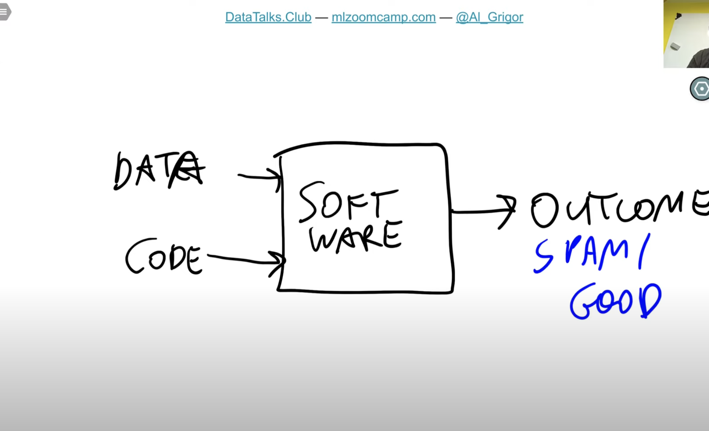
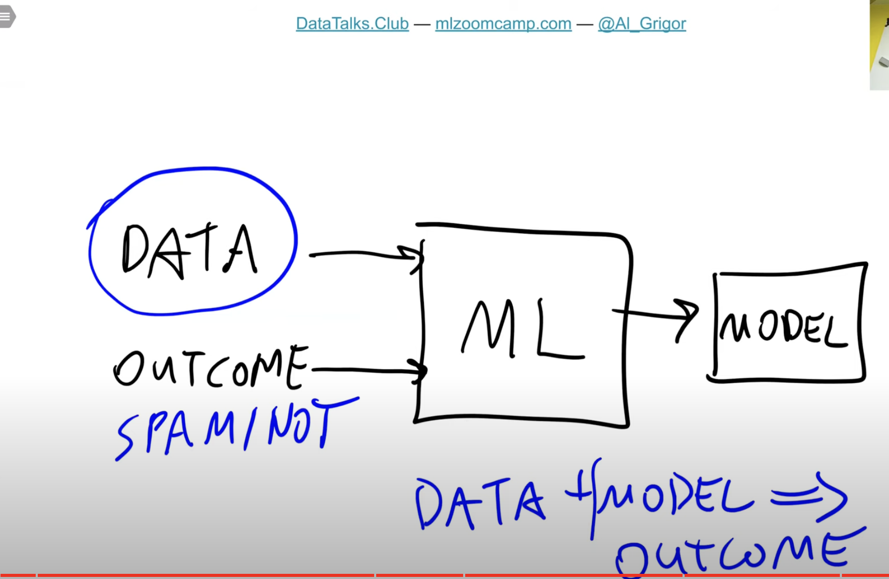
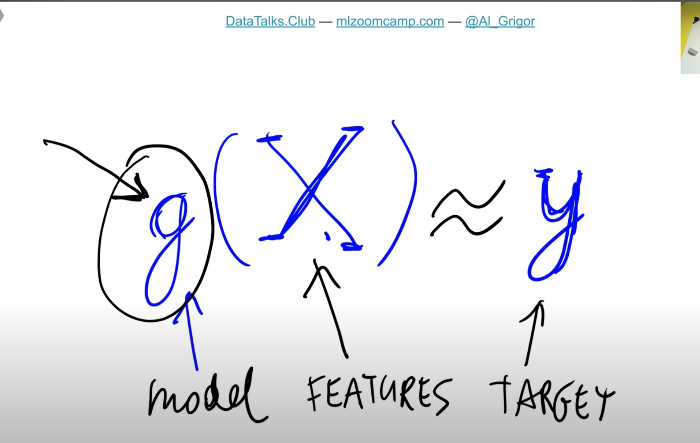
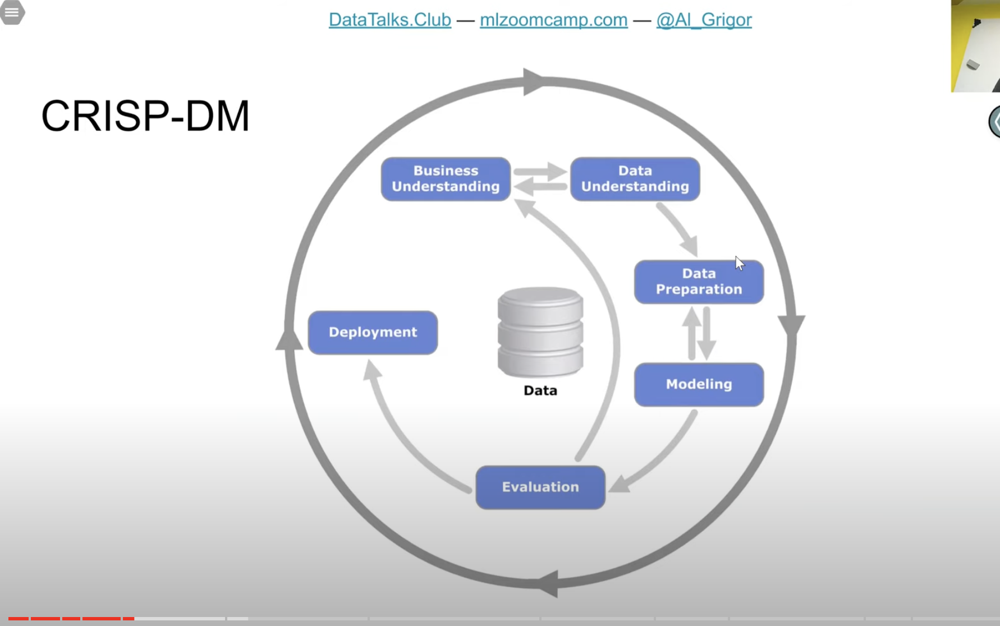

# Module 1

## Notes:

#### 1. Introduction to Machine Learning
- Machine learning is a process of extracting patterns from data
- Data is of two types.
    1. Features
    2. Target
- Information we know is called `features`, what we want to predict is called `target`
- `Features + Target` combination of both is used to train a model. Model encapsulates all the patterns that it finds from the data ingested to it
- We use the model to predict the data which is basically depicted as 
    `(Features + Model) ---> Predictions`


#### 2. ML vs Rule based systems
- Rule based system works better if the requirements are less complex
- As and when the new rules get added to predict an outcome, the complexity gets increased
- Machine learning outperforms rule based system if the prediction is dependent on multiple rules
- In ML, we basically start with rules and then use these rules as features.
- Example: the course talks about spam detection wherein, if the number of rules increases to detect a spam message like
    1. Domain name starts with `onlinetest.com`, `test.com`
    2. email body has `deposit` in it
    3. email subject length is greater than 20 words
    4. email subject looks suspicious - `you won a lottery`

   Rule based system makes the code complex where as an ML system just looks for patterns by marking each rule to either 1/0, making it easy to form a pattern for later use.
- Rule based system flow:



- ML bases system flow:



#### 3. Supervised Machine Learning
- Discussed about feature matrix (referred as <font size="6">`X`</font>) & target vector (referred as <font size="6">`y`</font>). 
- In the discussed example - Feature matrix is a 2D matrix with rows as observations, columns as features.
```
                [
 (observations) --> [1, 1, 0, 0, 1, 1] 
                --> [1, 1, 1, 0, 0, 1] 
                    [0, 1, 0, 1, 1, 1] 
                    [0, 0, 1, 1, 0, 0]
                     ↑ (features)
                ]
```
- 2D matrix above is treated as feature matrix <span style="font-size: 2em;">X</span>.




- Different types of Supervised Learning
    1. Regression (typically the output would be a number)
    2. Classification (typically outputs a category ex: car, spam example)
    3. Multiclass classification (images of cars, animals, etc)
    4. Binary (Special class of classification where the output is a binary. ex: spam or not)
    5. Ranking (Usually used in recommender systems to rank something)

#### 4. CRISP-DM
(Cross Industry Standard Process for Data Mining)

- Methodology that talks about how ML projects should be organized



1. **Business Understanding**: Identify business problem and how to solve it? Do we need ML to solve the problem? If not propose an alternative solution.
2. **Data Understanding**: Analyze the available data, decide if we need to collect any more data.
3. **Data Preparation**: Transform the data so it can be put to use in a ML model. This is basically the feature extraction from the data and remove any noise data.
4. **Modelling**: Training the model with the actual data. We train different models and choose the best model. To make the model better, you might need to go back and fix data if required.
5. **Evaluation**: Is the model good enough? Did we reach our goal? How good is the model performing, use metrics and deduce the model performance. Do we need to revisit the **business understanding** or do we need to change our **goal?**
6. **Deployment**: Happens together with **evaluation** step nowadays. We deploy model, we see how the model is doing, A/B testing etc and finalize the model.

We __**iterate**__ over the process multiple times and finzalize the models, deployments and reach the goal.


Screenshots taken from course videos: https://www.youtube.com/playlist?list=PL3MmuxUbc_hIhxl5Ji8t4O6lPAOpHaCLR